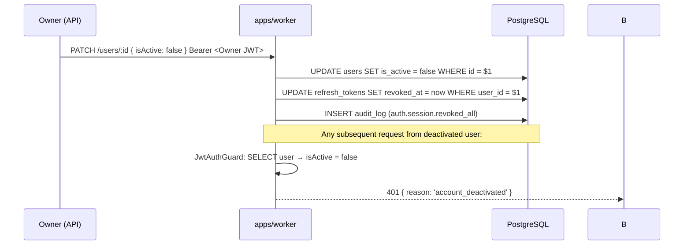

# Spec 01 — Authentication, Tenancy & Roles: Design

**Status:** APPROVED (Round 2) — ready for tasks.md.  
**Produced from:** requirements.md + all steering files + existing prisma/schema.prisma  
**Reviewer decisions incorporated:** OQ-1 (approved with constraints), OQ-2 (redirected → FirmDirectory table), OQ-3
(approved), OQ-4 (redirected → KMS adapter), OQ-5 (approved), OQ-6 (approved with hardening). Security XSS claim
corrected.  
**Round-2 amendments:** (1) RLS transaction scope narrowed — database isolation, not request-wide transaction; (2)
bootstrap uses dedicated `FirmDirectory` relation, not permissive `firms` policy; (3) OTP contact lookup uses
deterministic HMAC key, not bcrypt; (4) TOTP encryption-at-rest requirement made explicit; raw-Prisma access boundary
added; audit-log ownership model clarified.  
**Constraint:** No code is modified by this document. This is a design artefact only.

---

## Architectural Invariants

The following invariants are non-negotiable throughout implementation and must be stated in code-review checklists:

> **INV-1: Every RLS-protected database operation must execute within an active RLS transaction context.**  
> `SET LOCAL app.current_firm_id` must be issued inside the same PostgreSQL transaction as every query it protects.
> There is no fallback path that performs tenant-scoped Prisma queries outside that context.
>
> This does **not** mean every HTTP request is wrapped in a single long-lived transaction. The
> `RlsTransactionInterceptor` opens a transaction only when a database operation is about to occur, and the transaction
> is kept as short as possible — it must never span slow non-DB work such as bcrypt, TOTP verification, or external
> service calls. Expensive CPU/IO work that does not require the DB runs outside any open transaction.

> **INV-2: Authentication establishes identity; RLS establishes database isolation.**  
> Application-level `firmId` filtering is defence-in-depth, never the primary tenant-isolation mechanism. A passing
> application guard does not substitute for RLS.

> **INV-4: Application and domain modules must not directly import or inject the root Prisma client for tenant-scoped
> operations.**  
> All tenant-scoped database access must go through `PrismaRlsClient`. The raw `PrismaService`/`PrismaClient` is only
> permitted in: `TenantBootstrapService` (for `FirmDirectory` lookups before auth), `RlsTransactionInterceptor` (to open
> the transaction), and migration tooling.  
> An ESLint architecture rule (`no-restricted-imports` or an equivalent custom rule) enforces this statically.
> `PrismaRlsClient` throwing at runtime if called outside a transaction provides a second, runtime layer of enforcement.

> **INV-3: A valid authenticated client portal session must establish both `firmId` and `clientId` from the
> server-issued JWT.**  
> Neither value may be accepted from untrusted request parameters. The JWT is the only authoritative source of both
> values during a portal session.

---

## Table of Contents

1. [Architecture Summary](#1-architecture-summary)
2. [Data Model](#2-data-model)
3. [NestJS Authentication Module](#3-nestjs-authentication-module)
4. [Session & Cookie Strategy](#4-session--cookie-strategy)
5. [TOTP / 2FA Design](#5-totp--2fa-design)
6. [Key Management Service (KMS) Abstraction](#6-key-management-service-kms-abstraction)
7. [PostgreSQL RLS Strategy](#7-postgresql-rls-strategy)
8. [UI Component Tree & Interaction Flows](#8-ui-component-tree--interaction-flows)
9. [Security Threat Model](#9-security-threat-model)
10. [API / Request Flows](#10-api--request-flows)
11. [Implementation Boundaries](#11-implementation-boundaries)
12. [Definition-of-Done Alignment](#12-definition-of-done-alignment)

---

## 1. Architecture Summary

```
┌─────────────────────────────────────────────────────────────┐
│  apps/web  (Next.js)                                         │
│  ┌──────────────┐  ┌──────────────────────────────────────┐ │
│  │ (auth) routes│  │ middleware.ts                        │ │
│  │ /login       │  │ - locale prefix                      │ │
│  │ /2fa         │  │ - auth token presence check (edge)   │ │
│  │ /2fa-setup   │  │ - redirect to /login if no token     │ │
│  │ /recover     │  └──────────────────────────────────────┘ │
│  └──────────────┘                                            │
│  Auth state: Zustand (runtime memory only — never persisted) │
│  Token refresh: TanStack Query background refetch            │
└───────────────────────────┬─────────────────────────────────┘
                            │  HTTPS
                            │  Authorization: Bearer <access_token>
                            │  Cookie: refresh_token (HttpOnly)
┌───────────────────────────▼─────────────────────────────────┐
│  apps/worker  (NestJS)                                       │
│  AuthModule                                                  │
│  ├── AuthController         (public endpoints)               │
│  ├── TenantBootstrapService (pre-auth firm resolution)       │
│  ├── JwtStrategy + JwtAuthGuard  (global)                    │
│  ├── RolesGuard                                              │
│  ├── FirmGuard                                               │
│  └── RlsTransactionInterceptor  (opens short-lived tx per DB call group) │
└───────────────────────────┬─────────────────────────────────┘
                            │  Prisma inside explicit tx
                            │  SET LOCAL app.current_firm_id
                            │  SET LOCAL app.current_user_id
                            │  SET LOCAL app.session_type
                            │  SET LOCAL app.current_client_id (portal)
┌───────────────────────────▼─────────────────────────────────┐
│  PostgreSQL  (taxdesk_app role — no BYPASSRLS)               │
│  RLS policies on all tenant-scoped tables                    │
└─────────────────────────────────────────────────────────────┘
```

**Key design decisions:**

- The NestJS worker (`apps/worker`) is the sole authentication authority. `apps/web` holds access tokens in Zustand
  memory only and calls the worker API for all auth operations.
- Postgres RLS is the **last line of defence**. Application-layer `firmId` scoping plus `FirmGuard` are the primary
  controls. RLS prevents leaks from application bugs (INV-2).
- `SET LOCAL` is always inside an explicit short-lived Prisma `$transaction` that wraps only the database operations —
  enforced by `RlsTransactionInterceptor` + `PrismaRlsClient`. The transaction is never held open across bcrypt, TOTP
  verification, or any other non-DB work (INV-1).
- Pre-authentication firm resolution uses `TenantBootstrapService` querying a dedicated `FirmDirectory` table — not the
  full `firms` table — before the RLS context exists (Amendment 2 — see §2.1.1 and §3.7).
- Per-firm encryption keys are managed through a `KeyManagementService` adapter interface so the root-key backing is
  swappable without touching domain code (OQ-4 resolution — see §6).

---

## 2. Data Model

### 2.1 Changes to `prisma/schema.prisma`

The existing schema has `User`, `Firm`, `AuditLog`. This spec adds four new tables and extends two models.

#### 2.1.1 `Firm` — additions

```prisma
model Firm {
  // ... all existing fields unchanged ...

  // Per-firm session idle timeout (minutes); 0 = use system default (30 min)
  idleTimeoutMinutes  Int     @default(0)

  // Per-firm AES-256 data encryption key, wrapped (encrypted) by the
  // KeyManagementService root key. Never stored plain. See §6.
  // NULL until the first sensitive field for this firm is encrypted.
  // NOTE: This field makes the firms table sensitive — it is fully RLS-protected.
  // Pre-auth tenant resolution never touches firms directly; it uses FirmDirectory.
  encryptedDataKey    String?

  // New relations
  refreshTokens       RefreshToken[]
  otpCodes            OtpCode[]
}
```

#### 2.1.1b New: `FirmDirectory` (bootstrap/discovery table)

This table is the **only** table used during the pre-authentication tenant-resolution step. It contains no sensitive
firm configuration. Its sole purpose is to map a public `slug` to a `firmId` so the login handler can establish the RLS
context before touching any other table.

```prisma
model FirmDirectory {
  // Mirrors Firm.id — kept in sync by a DB trigger or application-layer hook
  // when a Firm is created, updated (slug/isActive changes), or deleted.
  firmId    String   @id
  slug      String   @unique
  isActive  Boolean

  @@map("firm_directory")
}
```

**Why a separate table instead of a permissive policy on `firms`:** `Firm` now contains `encryptedDataKey` — a sensitive
value. Postgres RLS is row-level, not column-level. A permissive `USING (true)` policy on `firms` would make the entire
row (including `encryptedDataKey`) accessible before authentication. `FirmDirectory` contains only `firmId`, `slug`, and
`isActive` — none of which are sensitive — so a fully open SELECT policy on it carries no security risk.

**Keeping the two in sync:** A Postgres trigger on `firms` (INSERT, UPDATE of slug/isActive, DELETE) maintains
`firm_directory`. Application code never writes to `firm_directory` directly.

#### 2.1.2 `User` — additions

```prisma
model User {
  // ... all existing fields unchanged ...
  // totpSecret String?  — already exists, stores AES-encrypted blob
  // totpEnabled Boolean — already exists

  // Pending TOTP secret during setup wizard (cleared on setup_complete)
  // Encrypted with the firm data key; NULL once totpEnabled = true
  totpSetupPendingSecret  String?

  // Timestamp when TOTP was last successfully used for authentication
  totpVerifiedAt          DateTime?

  // Updated on every successfully authenticated API request (async, best-effort)
  // Used by the refresh handler to enforce firm idle timeout
  lastActivityAt          DateTime?

  // Set when the user's password is changed.
  // Access tokens issued before this timestamp are considered stale and rejected.
  passwordChangedAt       DateTime?

  // New relations
  refreshTokens           RefreshToken[]
  recoveryCodes           RecoveryCode[]
}
```

#### 2.1.3 New: `RefreshToken`

```prisma
model RefreshToken {
  id          String    @id @default(uuid())
  firmId      String
  userId      String

  // SHA-256 hash of the actual opaque token value stored in the cookie.
  // The raw token is never stored in the database.
  tokenHash   String    @unique

  // The jti (JWT ID) of the access token that was issued alongside this refresh token.
  // Used for refresh-token-family invalidation on replay detection.
  jwtFamily   String

  // Device fingerprint for anomaly detection (new device alert)
  userAgent   String?
  ipAddress   String?

  expiresAt   DateTime
  revokedAt   DateTime?  // NULL = active; set to revoke immediately
  createdAt   DateTime  @default(now())

  firm        Firm      @relation(fields: [firmId], references: [id])
  user        User      @relation(fields: [userId], references: [id])

  @@index([userId])
  @@index([firmId])
  @@index([jwtFamily])   // for family invalidation sweep
  @@index([expiresAt])   // for nightly cleanup job
  @@map("refresh_tokens")
}
```

#### 2.1.4 New: `RecoveryCode`

```prisma
model RecoveryCode {
  id          String    @id @default(uuid())
  userId      String
  firmId      String

  // bcrypt hash (cost 10) of the 10-character hex code shown once to the user
  codeHash    String

  usedAt      DateTime?  // NULL = available; set to prevent reuse
  createdAt   DateTime  @default(now())

  user        User      @relation(fields: [userId], references: [id])

  @@index([userId])
  @@map("recovery_codes")
}
```

Ten codes per user, generated at TOTP setup. Single-use. Each consumption logs `auth.2fa.recovery_code_used`.

#### 2.1.5 New: `OtpCode` (client portal)

```prisma
model OtpCode {
  id           String    @id @default(uuid())
  firmId       String

  // Deterministic HMAC-SHA256(OTP_CONTACT_SECRET, normalise(contactAddress)).
  // HMAC uses a server-side secret (OTP_CONTACT_SECRET env var) so the hash
  // is deterministic and can be used for efficient rate-limit and lookup queries.
  // The raw address is never stored.
  contactHmac  String

  channel      String    // "email" | "sms"

  // One-way hash (bcrypt cost 10) of the 6-digit numeric OTP value.
  // bcrypt is suitable here because the OTP is short-lived (10 min) and
  // we are hashing the OTP itself (not the lookup key).
  otpHash      String

  expiresAt    DateTime
  usedAt       DateTime?
  attempts     Int       @default(0)  // max 3; code invalidated when reached
  createdAt    DateTime  @default(now())

  firm         Firm      @relation(fields: [firmId], references: [id])

  @@index([firmId, contactHmac])  // deterministic: efficient lookup
  @@index([expiresAt])            // for nightly cleanup
  @@map("otp_codes")
}
```

OTP: 6 digits, 10-minute expiry, max 3 verification attempts, max 3 sends per contact per hour.

**Why HMAC for the contact, not bcrypt:**  
bcrypt is non-deterministic — each hash produces a different salt. A query `WHERE contactHmac = bcrypt(email)` is
impossible to execute efficiently. HMAC-SHA256 with a fixed server secret produces a deterministic, constant-time output
that can be indexed and queried directly. The contact address is still never stored in plaintext; the HMAC is
effectively a keyed pseudonym.

**Lookup and verification flow:**

```
1. Normalise contact address (lowercase, trim)
2. contactHmac = HMAC-SHA256(OTP_CONTACT_SECRET, normalised)
3. Rate-limit check: COUNT active OtpCodes WHERE firmId = ? AND contactHmac = ?
                     in the last hour (max 3 sends)
4. Generate 6-digit OTP (crypto.randomInt(0, 999999).toString().padStart(6,'0'))
5. otpHash = bcrypt(otp, cost=10)
6. INSERT OtpCode { firmId, contactHmac, channel, otpHash, expiresAt }
7. Send OTP to contact address via NotificationProvider (raw address used only here)

Verification:
1. contactHmac = HMAC-SHA256(OTP_CONTACT_SECRET, normalised)
2. SELECT latest active OtpCode WHERE firmId = ? AND contactHmac = ? AND expiresAt > now AND usedAt IS NULL
3. bcrypt.compare(submittedOtp, record.otpHash)
4. On match: mark usedAt = now; issue portal JWT
```

`OTP_CONTACT_SECRET` is a separate environment variable (≥32 random bytes) from `ENCRYPTION_MASTER_KEY`.

#### 2.1.6 Audit event catalogue for this spec

All entries use the existing `AuditLog` model. The `action` field is a string (no DB enum — avoid migration churn when
adding events). Safe-to-log fields are noted explicitly to prevent accidentally logging secrets.

| `action`                        | Safe payload fields                                 | Never log              |
| ------------------------------- | --------------------------------------------------- | ---------------------- |
| `auth.login.success`            | userId, firmId, ipAddress, userAgent                | password, tokens       |
| `auth.login.password_fail`      | firmId, email (hashed), ipAddress                   | password               |
| `auth.login.account_locked`     | userId, firmId, lockedUntil                         | password               |
| `auth.login.totp_fail`          | userId, firmId, attemptCount                        | TOTP code              |
| `auth.login.recovery_code_used` | userId, firmId                                      | code plaintext         |
| `auth.logout`                   | userId, firmId                                      | tokens                 |
| `auth.session.expired`          | userId, firmId, reason                              | tokens                 |
| `auth.session.refresh`          | userId, firmId, ipAddress                           | tokens                 |
| `auth.session.revoked_all`      | userId, firmId, reason                              | tokens                 |
| `auth.totp.setup_started`       | userId, firmId                                      | secret                 |
| `auth.totp.setup_complete`      | userId, firmId                                      | secret, codes          |
| `auth.totp.disabled`            | userId, firmId, actorId                             | secret                 |
| `auth.otp.sent`                 | firmId, channel, contactHmac                        | OTP value, email/phone |
| `auth.otp.verified`             | firmId, contactHmac                                 | OTP value              |
| `auth.otp.fail`                 | firmId, contactHmac, attempts                       | OTP value              |
| `auth.anomaly.cross_firm`       | userId, requestedFirmId, actualFirmId, ipAddress    | tokens                 |
| `auth.anomaly.new_device`       | userId, firmId, ipAddress, userAgent                | tokens                 |
| `auth.role.changed`             | actorId, targetUserId, firmId, oldRole, newRole     | —                      |
| `auth.permissions.updated`      | actorId, firmId                                     | —                      |
| `auth.sensitive_field.viewed`   | userId, firmId, resourceType, resourceId, fieldName | field value            |

#### 2.1.7 Constraints, indexes, and deletion behaviour

| Table            | Key constraints                              | On `User` delete   | On `Firm` delete                 |
| ---------------- | -------------------------------------------- | ------------------ | -------------------------------- |
| `firm_directory` | `slug` UNIQUE; `firmId` PK (mirrors Firm.id) | —                  | CASCADE (via DB trigger)         |
| `refresh_tokens` | `tokenHash` UNIQUE; FK userId, firmId        | CASCADE            | CASCADE                          |
| `recovery_codes` | FK userId                                    | CASCADE            | CASCADE (via userId)             |
| `otp_codes`      | FK firmId                                    | —                  | CASCADE                          |
| `users`          | UNIQUE (firmId, email)                       | RESTRICT           | RESTRICT                         |
| `audit_logs`     | FK userId NULLABLE; FK firmId                | SET NULL on userId | RESTRICT (data must be retained) |

---

## 3. NestJS Authentication Module

### 3.1 Module structure

```
apps/worker/src/modules/auth/
├── auth.module.ts
├── auth.controller.ts
├── auth.service.ts               # orchestrates login, TOTP, session
├── totp.service.ts               # TOTP generation, verification, recovery
├── otp.service.ts                # portal OTP send/verify
├── token.service.ts              # JWT issue/refresh/revoke, refresh token DB ops
├── tenant-bootstrap.service.ts   # pre-auth firm resolution via FirmDirectory (see §3.7)
├── guards/
│   ├── jwt-auth.guard.ts         # global; validates access token + sessionState
│   ├── roles.guard.ts            # checks @Roles() decorator
│   └── firm.guard.ts             # cross-firm 404 + audit
├── interceptors/
│   └── rls-transaction.interceptor.ts  # stores identity in ALS; services call withRlsContext()
├── strategies/
│   └── jwt.strategy.ts           # Passport JWT strategy; pins HS256
├── decorators/
│   ├── public.decorator.ts       # @Public() — skips JwtAuthGuard
│   ├── allow-partial-session.decorator.ts  # @AllowPartialSession()
│   ├── roles.decorator.ts        # @Roles(UserRole.OWNER, ...)
│   └── current-user.decorator.ts # @CurrentUser() → AuthenticatedUser
└── dto/
    ├── login.dto.ts
    ├── totp-verify.dto.ts
    ├── totp-setup-confirm.dto.ts
    ├── refresh.dto.ts
    ├── otp-send.dto.ts
    └── otp-verify.dto.ts
```

### 3.2 Controllers and endpoints

| Method + path                       | Guard                           | Notes                                                         |
| ----------------------------------- | ------------------------------- | ------------------------------------------------------------- |
| `POST /auth/login`                  | `@Public()`                     | Body: `{ firmSlug, email, password }`                         |
| `POST /auth/totp/verify`            | `@Public()`                     | Body: `{ code }` or `{ recoveryCode }`; partial JWT in header |
| `POST /auth/totp/setup/initiate`    | `@JwtAuth @AllowPartialSession` | Requires `sessionState: 'partial'`                            |
| `POST /auth/totp/setup/confirm`     | `@JwtAuth @AllowPartialSession` | Body: `{ code }`                                              |
| `POST /auth/totp/setup/complete`    | `@JwtAuth @AllowPartialSession` | Acknowledge codes seen; issues full JWT                       |
| `POST /auth/refresh`                | `@Public()`                     | Uses HttpOnly cookie only; no body                            |
| `POST /auth/logout`                 | `@JwtAuth`                      | Revokes current device's refresh token                        |
| `POST /auth/otp/send`               | `@Public()`                     | Portal; body: `{ firmSlug, contact, channel }`                |
| `POST /auth/otp/verify`             | `@Public()`                     | Portal; body: `{ firmSlug, contact, code }`                   |
| `GET  /auth/me`                     | `@JwtAuth`                      | Returns `{ user, firm }` for current session                  |
| `POST /auth/password-reset/request` | `@Public()`                     | **Stub only** — returns 501 in this spec                      |

All endpoints return RFC 7807 Problem Details JSON on error. No stack traces in error responses.

### 3.3 JWT payload shape

```typescript
interface JwtPayload {
  // Standard claims
  sub: string // userId
  iat: number
  exp: number
  jti: string // unique per token; used as jwtFamily for refresh token family

  // Application claims
  firmId: string
  role: UserRole
  // "partial" = password verified, TOTP not yet presented
  // "full"    = fully authenticated
  sessionState: 'partial' | 'full'
  // "staff" | "portal" — determines which RLS session variables are set
  sessionType: 'staff' | 'portal'
  // Set only for portal sessions (from ClientPortalAccess lookup, not from request)
  clientId?: string
}
```

`JwtAuthGuard` enforces:

1. Valid HS256 signature.
2. Token not expired (`exp`).
3. `passwordChangedAt` check: if `user.passwordChangedAt > token.iat` → reject (password changed after this token was
   issued).
4. `user.isActive === true`.
5. `sessionState === 'full'` unless the route has `@AllowPartialSession`.

### 3.4 AuthService flows

**`login(firmSlug, email, password, meta)`**

```
1. TenantBootstrapService.resolveFirm(firmSlug)          // §3.7
   → If firm not found: record timing-safe delay, return generic error
2. Set RLS context: SET LOCAL app.current_firm_id = firm.id
3. Load User WHERE firmId = firm.id AND email = email
   → If not found: run bcrypt.compare against a dummy hash (timing equalisation)
     → return generic error "Invalid credentials"
4. Check lockedUntil: if in future → return generic error (same message)
   Log auth.login.account_locked (do not reveal lockout in the response)
5. bcrypt.compare(password, user.passwordHash)
   → On fail:
     a. Increment failedLoginCount
     b. If failedLoginCount >= 3: set lockedUntil = now+30min, enqueue lock email
     c. Log auth.login.password_fail
     d. Return generic error
6. Reset failedLoginCount = 0
7. IF totpEnabled = false → issue partial JWT, return { requiresTotpSetup: true }
8. IF totpEnabled = true  → issue partial JWT, return { requiresTotp: true }
```

Generic error text for all step-3 through step-6 failures: `"Invalid credentials."` — identical wording, no distinction.

**`verifyTotp(partialJwt, code | recoveryCode, meta)`**

```
1. Validate partial JWT; reject if sessionState !== 'partial'
2. If code provided:
   a. Decrypt user.totpSecret using KMS
   b. otplib.authenticator.verify(code, secret, { window: 1 })
   c. On fail: log auth.login.totp_fail, increment totp failure counter
      If 5 consecutive failures in 10 min → lock account, log auth.login.account_locked
      Return generic error
3. If recoveryCode provided:
   a. Load unused RecoveryCodes for userId (up to 10)
   b. bcrypt.compare(recoveryCode, each hash) — rate limit: 3 attempts / 15 min
   c. On match: mark usedAt=now, log auth.login.recovery_code_used
   d. On no match: return generic error
4. On success:
   a. Issue full JWT + new RefreshToken (see §4)
   b. Set HttpOnly cookie
   c. Update lastLoginAt, totpVerifiedAt
   d. Log auth.login.success
   e. Anomaly check: compare ipAddress/userAgent to last RefreshToken.
      If different → log auth.anomaly.new_device (email deferred to Phase 1b)
```

### 3.5 Guards

**`JwtAuthGuard`** — global, applied to everything not `@Public()`

- Validates JWT signature (HS256 pinned), expiry, `isActive`, `passwordChangedAt`.
- Rejects `sessionState: 'partial'` unless route has `@AllowPartialSession`.
- On failure: 401 Problem Details. Never reveals which check failed.

**`RolesGuard`** — applied after JwtAuthGuard

- Reads `@Roles(...)`. If absent, passes.
- `Reviewer` role: allowed only explicit read operations. All write operations (POST, PUT, PATCH, DELETE) are denied
  unless `@Roles` explicitly includes `REVIEWER`.
- On failure: 403 Problem Details.

**`FirmGuard`** — applied to all resource routes

- Extracts `firmId` from the resource being accessed (route param, query param, or body field — defined per route via
  `@FirmIdFrom('param' | 'body.firmId')` metadata).
- Compares to `request.user.firmId` from JWT.
- On mismatch: 404 (not 403, per requirements §2.3). Logs `auth.anomaly.cross_firm`.

### 3.6 `RlsTransactionInterceptor` and `PrismaRlsClient` — enforcing INV-1

**The core requirement (INV-1):** every RLS-protected query must execute inside a transaction that has already issued
`SET LOCAL`. The transaction must be as short as possible — it must never hold a connection while bcrypt runs, TOTP is
verified, or any external service is called.

**Design: short-lived, on-demand transactions**

The interceptor does not wrap the entire HTTP request in one transaction. Instead, it provides a `withRlsContext(fn)`
helper that service methods call explicitly around their database work:

```
HTTP request arrives
  ↓
JwtAuthGuard resolves identity (user, firmId, sessionType, clientId)
  ↓
RlsTransactionInterceptor stores identity in AsyncLocalStorage; calls next.handle()
  ↓
Route handler / service runs — no DB connection held yet
  ↓
Service needs DB → calls prismaRls.withRlsContext(async (tx) => {
    // SET LOCAL vars issued here, inside the transaction
    await tx.$executeRaw`SET LOCAL app.current_firm_id = ${firmId}`
    await tx.$executeRaw`SET LOCAL app.current_user_id = ${userId}`
    // ... tenant-scoped queries ...
  })
  ← transaction commits, connection returned to pool
  ↓
Service returns to route handler (no connection held)
  ↓
Response sent
```

Expensive non-DB work (bcrypt, TOTP verification, OTP code generation) runs **outside** the `withRlsContext` block and
therefore outside any open transaction.

```typescript
// Conceptual PrismaRlsClient shape
@Injectable({ scope: Scope.REQUEST })
export class PrismaRlsClient {
  /**
   * Run fn inside a short-lived Prisma transaction with RLS session variables
   * set for the current request's authenticated identity.
   * Throws if called before identity has been established (INV-1).
   */
  async withRlsContext<T>(fn: (tx: Prisma.TransactionClient) => Promise<T>): Promise<T> {
    const identity = rlsIdentityStorage.getStore()
    if (!identity) {
      throw new Error('INV-1 violated: no RLS identity in context — is JwtAuthGuard active?')
    }
    return this.prisma.$transaction(async (tx) => {
      await tx.$executeRaw`SET LOCAL app.current_firm_id = ${identity.firmId}`
      await tx.$executeRaw`SET LOCAL app.current_user_id = ${identity.userId}`
      await tx.$executeRaw`SET LOCAL app.session_type = ${identity.sessionType}`
      if (identity.clientId) {
        await tx.$executeRaw`SET LOCAL app.current_client_id = ${identity.clientId}`
      }
      return fn(tx)
    })
  }
}
```

**Connection pool safety:** `SET LOCAL` is scoped to the current transaction. When the `$transaction` callback
completes, the connection is returned to the pool with all session variables cleared by Postgres automatically. There is
no risk of RLS context leaking across pooled connections.

**Multiple DB round-trips in one request:** if a service needs two separate DB operations that are logically
independent, it calls `withRlsContext` twice (two short transactions). If they must be atomic, they share one
`withRlsContext` call. The key principle is that the DB connection is not held between operations.

**Public endpoints** (`@Public()`) — such as `/auth/refresh` and `/auth/otp/send` — do not use `PrismaRlsClient`. They
call `TenantBootstrapService` directly, which uses a separate minimal client that queries only `FirmDirectory` (see
§3.7).

### 3.7 `TenantBootstrapService` — pre-auth firm resolution (Amendment 2)

The login, OTP send, OTP verify, and refresh endpoints must identify the tenant before full authentication is
established. The sequence is:

```
firmSlug (from request body)
    ↓ canonicalise: lowercase, trim, validate slug format (^[a-z0-9-]{2,60}$)
    ↓
TenantBootstrapService.resolveFirm(slug)
    ↓ SELECT firm_id, is_active FROM firm_directory WHERE slug = $1
    ↓ (uses prismaBootstrap — queries only firm_directory, never firms)
    ↓
firmId  (if found and active)
    ↓
Begin tenant-scoped operations via PrismaRlsClient.withRlsContext(...)
```

**`FirmDirectory` — why a dedicated table:**

`Firm.encryptedDataKey` makes the `firms` table sensitive. Postgres RLS is row-level, not column-level. A permissive
`USING (true)` policy on `firms` would expose `encryptedDataKey` to unauthenticated queries. `FirmDirectory` contains
only `{ firmId, slug, isActive }` — no secrets — and can safely have an open SELECT policy.

`TenantBootstrapService` uses `prismaBootstrap` — a `PrismaClient` instance that:

- Connects as `taxdesk_app` (same DB role; no privilege escalation).
- Queries **only** `firm_directory`.
- Never has `SET LOCAL` issued on it (no RLS context needed — `FirmDirectory` is intentionally open for SELECT).

**Enumeration protection:**

- `slug` lookup timing is not constant (not found = faster than found + bcrypt). Mitigated by: always returning a
  generic `"Invalid credentials"` error for all auth failures, always running `bcrypt.compare` with a dummy hash if the
  user is not found, and applying rate limiting per IP to the entire login path.
- The endpoint never discloses whether a slug is registered.
- `FirmDirectory` returns only `firmId` and `isActive` — nothing that identifies real client or financial data.

**Keeping `FirmDirectory` in sync with `firms`:** A Postgres trigger on `firms` (INSERT, UPDATE on slug or isActive,
DELETE) maintains `firm_directory`. Application code never writes to `firm_directory` directly — it is a read-only
projection from the application's perspective.

---

## 4. Session & Cookie Strategy

### 4.1 Token pair

| Token                  | Storage                                         | Lifetime       | Purpose                                                 |
| ---------------------- | ----------------------------------------------- | -------------- | ------------------------------------------------------- |
| Access JWT             | Zustand (runtime memory only — never persisted) | 15 min         | Authorises API calls via `Authorization: Bearer` header |
| Refresh token (opaque) | HttpOnly cookie (browser) + hashed in DB        | 7 days rolling | Issues new access tokens; enables instant revocation    |

On page reload: app calls `POST /auth/refresh` immediately. Success → new access token into Zustand. Failure → redirect
to `/[locale]/login`.

### 4.2 Cookie configuration

```
Set-Cookie: refresh_token=<opaque-value>
  HttpOnly                  # JS cannot read it
  Secure                    # HTTPS only (enforced in production; dev may relax)
  SameSite=Strict           # Never sent on cross-site requests
  Path=/auth                # Scoped to /auth/* only; not sent with API calls
  Max-Age=604800            # 7 days
  Domain=<env-configured>   # Set per environment; not hard-coded
```

**CSRF stance:** State-mutating API endpoints receive the access JWT in the `Authorization: Bearer` header (not a
cookie). A CSRF attack cannot inject the Bearer header. The refresh cookie uses `SameSite=Strict`, which blocks
cross-site sending. No additional CSRF token is required.

### 4.3 Idle timeout enforcement

- `User.lastActivityAt` is updated asynchronously (fire-and-forget, outside the RLS transaction) on every successfully
  authenticated request. One UPDATE per 60-second window to avoid high write volume.
- The `/auth/refresh` handler reads `lastActivityAt` and compares to `firm.idleTimeoutMinutes` (default 30 min, 0 =
  system default).
- If idle timeout exceeded: revoke the refresh token, return `401 { reason: 'idle_timeout' }`.
- Frontend: computes estimated expiry from `iat` + firm timeout (returned in `/auth/me`). Shows a "Session expiring in 2
  minutes" modal at T-2 min. User can extend by clicking "Stay signed in" (triggers a no-op API call to refresh
  `lastActivityAt`).

### 4.4 Refresh token rotation and replay protection

- Every successful use of a refresh token **rotates** it: old DB record `revokedAt = now`, new record inserted, new
  cookie set.
- **Replay detection:** if a refresh token that has already been rotated (i.e. `revokedAt` is set) is presented, the
  server detects a potential theft or replay. It revokes **all** refresh tokens sharing the same `jwtFamily` value,
  forcing full re-authentication. Logs `auth.anomaly.replay_detected`.
- `jwtFamily` = the `jti` from the access JWT issued at login. All refresh tokens in a session chain share this value.

### 4.5 Session fixation prevention

- A fresh `jti` and a new `RefreshToken` record are always created at authentication. No upgrade of an existing token.
- Partial JWTs (pre-TOTP) use a different `jti` than the full JWT issued after TOTP.

### 4.6 Multi-device sessions

- Multiple `RefreshToken` records per user are supported (one per device/browser).
- Logout: revokes the current device's token only.
- Deactivation (`isActive = false`): all `RefreshToken` records for the user are revoked immediately. Next request from
  any device returns 401.

---

## 5. TOTP / 2FA Design

### 5.1 Libraries (server-side only)

- `otplib` — RFC 6238 TOTP generation and verification.
- `qrcode` — QR code PNG generation (returns base64 data URL, never stored).
- `crypto` (Node built-in) — secret generation and recovery code generation.

None of these run in the browser. The QR code is rendered from a data URL returned by the server.

### 5.2 Enrollment flow

```
Step 1 — Initiate (POST /auth/totp/setup/initiate):
  - Require partial JWT (sessionState: 'partial', totpEnabled: false)
  - Generate 20 random bytes → base32-encode → TOTP secret
  - Encrypt secret using KMS (§6) → store in User.totpSetupPendingSecret
  - Build otpAuthUrl: "otpauth://totp/TaxDeskPK:<email>?secret=<b32>&issuer=TaxDeskPK"
  - Generate QR code PNG → base64 data URL (never stored, ephemeral response)
  - Return: { otpAuthUrl, qrCodeDataUrl, secretDisplayText }
  - Log: auth.totp.setup_started

Step 2 — Confirm (POST /auth/totp/setup/confirm):
  - Require partial JWT
  - User enters code from authenticator
  - Decrypt totpSetupPendingSecret using KMS
  - otplib.authenticator.verify({ token: code, secret, window: 1 })
  - On fail: return 422 { reason: 'invalid_code' }; max 5 attempts (same lock as login)
  - On success:
    * Copy totpSetupPendingSecret → totpSecret; clear totpSetupPendingSecret
    * Set totpEnabled = true, totpVerifiedAt = now
    * Generate 10 recovery codes (crypto.randomBytes(5).toString('hex').toUpperCase())
    * bcrypt.hash each code (cost 10) → INSERT 10 RecoveryCode rows
    * Return: { recoveryCodes: string[] }  ← shown ONCE; never re-retrievable
    * Log: auth.totp.setup_complete

Step 3 — Complete (POST /auth/totp/setup/complete):
  - User acknowledges they have saved the recovery codes
  - Issue full JWT + refresh token
  - Return: { accessToken } + Set-Cookie
```

### 5.3 Verification at every login

1. User presents 6-digit code.
2. Server decrypts `totpSecret` via KMS, runs `otplib.authenticator.verify` with `window: 1` (±30 s clock-skew
   tolerance).
3. On 5 consecutive failures within 10 minutes → account lock. Same lock mechanism as password failures.
4. On success → issue full JWT + refresh token.

### 5.4 Recovery codes

- 10 codes, each 10 hex characters (e.g. `A3F7C2E891`).
- Each individually bcrypt-hashed (cost 10) in `RecoveryCode` table.
- Displayed once at setup. Download as plain-text file is encouraged.
- On use: iterate `RecoveryCode` rows for user, `bcrypt.compare` each. On match → mark `usedAt = now`, issue full JWT,
  log event.
- Rate limit: 3 attempts per 15 minutes per user (Redis-backed throttle).
- When ≤ 2 unused codes remain: persistent warning banner on every staff page.
- Stub endpoint for recovery code regeneration is required (returns 501 in this spec).

### 5.5 TOTP secret encryption at rest (explicit requirement)

Both `User.totpSecret` and `User.totpSetupPendingSecret` **must always be stored encrypted**. They are never stored as
plaintext, not even temporarily.

The encryption path is:

```
plaintext secret (20 bytes, in memory only)
    ↓ KMS.unwrapDataKey(firm.encryptedDataKey)  → dataKey (in memory only)
    ↓ KMS.encryptWithDataKey(dataKey, secret)   → AES-256-GCM ciphertext
    ↓ stored in DB as base64 string
    // dataKey and plaintext discarded immediately
```

The decryption path (used transiently during TOTP verification):

```
ciphertext from DB
    ↓ KMS.unwrapDataKey(firm.encryptedDataKey)   → dataKey (in memory only)
    ↓ KMS.decryptWithDataKey(dataKey, ciphertext) → plaintext secret (in memory only)
    ↓ otplib.verify(code, secret)
    // plaintext and dataKey discarded immediately after verify()
```

The plaintext secret must never be:

- Returned to any API client.
- Written to any log, trace, or structured log field.
- Stored in any cache (Redis, in-memory, etc.).
- Held in a variable beyond the scope of the single encrypt or verify call.

### 5.6 Lost-device recovery

1. "I can't access my authenticator" → show recovery code input.
2. If all codes exhausted → show "Contact your firm Owner to reset 2FA" message.
3. Owner can trigger TOTP reset via Settings → logs `auth.totp.disabled`; user is forced through setup again on next
   login.

### 5.7 Rate limits summary

| Endpoint                        | Limit mechanism                                       |
| ------------------------------- | ----------------------------------------------------- |
| `POST /auth/login`              | 10 req / IP / 15 min; 5 per account / 15 min          |
| `POST /auth/totp/verify`        | 5 consecutive failures → account lock (10 min window) |
| `POST /auth/totp/setup/confirm` | 5 consecutive failures → account lock                 |
| Recovery code attempts          | 3 per 15 min per userId (Redis counter)               |
| `POST /auth/otp/send`           | 3 per contactHmac per hour per firmId                 |
| `POST /auth/otp/verify`         | 3 attempts per OTP code instance (then invalidate)    |
| `POST /auth/refresh`            | 30 per IP / min                                       |

All rate limits are enforced by `@nestjs/throttler` with a Redis store (`ioredis`). Multi-instance safe.

---

## 6. Key Management Service (KMS) Abstraction

### 6.1 Motivation (OQ-4 resolution)

Envelope encryption is required for TOTP secrets, CNIC/NTN fields (later specs), and the TOTP pending secret. The
root/master key must never live in the database. However, "store master key in `.env` and call it KMS" is not acceptable
— it just moves the problem one layer.

The design mandates a `KeyManagementService` adapter interface so the root-key backing is fully swappable:

### 6.2 Interface

```typescript
// packages/schemas/src/kms/index.ts  (shared interface)
export interface KeyManagementService {
  /**
   * Generate a new random 256-bit data key.
   * Returns the raw key AND a wrapped (encrypted) version safe for DB storage.
   */
  generateDataKey(): Promise<{ plaintext: Buffer; wrapped: string }>

  /**
   * Decrypt a wrapped data key back to plaintext.
   * Only called transiently — plaintext is never stored.
   */
  unwrapDataKey(wrapped: string): Promise<Buffer>

  /**
   * Encrypt arbitrary plaintext bytes with a given data key.
   * Returns a base64-encoded ciphertext blob (includes IV and auth tag).
   */
  encryptWithDataKey(dataKey: Buffer, plaintext: Buffer): Promise<string>

  /**
   * Decrypt a ciphertext blob encrypted with a given data key.
   */
  decryptWithDataKey(dataKey: Buffer, ciphertext: string): Promise<Buffer>
}
```

### 6.3 Local / development adapter

- Uses Node.js `crypto`: AES-256-GCM for data-key wrapping and field encryption.
- Root key comes from `ENCRYPTION_MASTER_KEY` env var (32 random bytes, base64-encoded).
- Acceptable for local development and MVP, provided:
  - The master key is not stored in the repository.
  - The master key in production is rotated regularly and stored in a secrets manager (e.g. AWS Secrets Manager,
    HashiCorp Vault), not plain in `.env`.
  - The `.env.example` shows only a placeholder.

```
LocalKmsAdapter:
  wrap(dataKey):
    IV = crypto.randomBytes(12)
    cipher = createCipheriv('aes-256-gcm', masterKey, IV)
    ciphertext = cipher.update(dataKey) + cipher.final()
    authTag = cipher.getAuthTag()
    return base64(IV + authTag + ciphertext)

  unwrap(wrapped):
    [IV, authTag, ciphertext] = decode(base64(wrapped))
    decipher = createDecipheriv('aes-256-gcm', masterKey, IV)
    decipher.setAuthTag(authTag)
    return decipher.update(ciphertext) + decipher.final()
```

### 6.4 Production adapter (interface-compatible, future)

The `ProductionKmsAdapter` will call AWS KMS (or equivalent) for `generateDataKey` and `decrypt`. No domain code changes
— only the DI binding in `AuthModule` changes.

### 6.5 Usage pattern

```
Per-firm data key lifecycle:
  1. Firm created → KMS.generateDataKey() → store wrapped key in Firm.encryptedDataKey
  2. Encrypt a field:
       dataKey = KMS.unwrapDataKey(firm.encryptedDataKey)
       ciphertext = KMS.encryptWithDataKey(dataKey, plaintext)
       // dataKey immediately discarded from memory
  3. Decrypt a field:
       dataKey = KMS.unwrapDataKey(firm.encryptedDataKey)
       plaintext = KMS.decryptWithDataKey(dataKey, ciphertext)
       // dataKey immediately discarded from memory
```

The plaintext data key is never stored. It lives only in a local variable for the duration of one encrypt/decrypt call.

### 6.6 Key rotation

**Master key rotation (root key, e.g. `ENCRYPTION_MASTER_KEY`):** When the master key is rotated:

1. Each firm's `encryptedDataKey` is re-wrapped:
   `unwrap(oldMasterKey) → plaintext dataKey → wrap(newMasterKey) → store new wrapped key`.
2. The individual field ciphertexts are **not** re-encrypted — only the wrapper changes.
3. Rotation is a background job (`KeyRotationJob` in `apps/worker`); each firm is processed individually to limit blast
   radius.
4. The old master key must remain available during rotation (dual-key period) and is retired only after all firms'
   `encryptedDataKey` values have been re-wrapped.
5. Rotation is logged to the audit log (action: `kms.key_rotation.complete`, per-firm).

**Data key rotation (per-firm AES key):** Triggered explicitly (e.g. a firm requests key rotation after a suspected
compromise):

1. Generate a new data key for the firm.
2. Re-encrypt all fields that use the old data key (TOTP secrets, CNICs, NTNs — in later specs) with the new key in a
   single background transaction.
3. Store the new wrapped data key in `Firm.encryptedDataKey`.
4. The old plaintext data key is discarded; the old wrapped value is overwritten.

**For MVP (`LocalKmsAdapter`):** Master key rotation and data key rotation are documented procedures that must be
executed manually using a migration script. The `KeyManagementService` interface is designed so that a managed KMS (e.g.
AWS KMS) handles rotation automatically in the production adapter.

---

## 7. PostgreSQL RLS Strategy

### 7.1 Layered defence model

```
Layer 1 (primary):    Application services scope every query by firmId
Layer 2 (secondary):  FirmGuard compares JWT firmId to resource firmId
Layer 3 (safety net): Postgres RLS — last line of defence (INV-2)
```

A query failing RLS is a bug in layers 1 or 2, not an expected path.

### 7.2 Runtime database role and table ownership

The tamper-resistance of the audit log depends on a correct ownership model. `REVOKE UPDATE/DELETE` is only effective if
`taxdesk_app` does not own the `audit_logs` table (table owners implicitly have all privileges and can bypass a
`REVOKE`).

```sql
-- ── Table ownership ─────────────────────────────────────────────────────────
-- All tables are created by the migration role (taxdesk_migrations).
-- taxdesk_app is granted only the permissions it needs.
-- taxdesk_app MUST NOT be the owner of any table.

-- Migration role (used only by Prisma migrate, never at runtime):
CREATE ROLE taxdesk_migrations WITH LOGIN PASSWORD '...';
-- taxdesk_migrations owns all tables (created via Prisma migrate).
-- It is never used at application runtime.

-- Runtime role:
CREATE ROLE taxdesk_app WITH LOGIN PASSWORD '...';
-- No SUPERUSER. No BYPASSRLS. No table ownership.

-- ── Runtime grants ───────────────────────────────────────────────────────────
GRANT CONNECT ON DATABASE taxdesk TO taxdesk_app;
GRANT USAGE ON SCHEMA public TO taxdesk_app;
GRANT SELECT, INSERT, UPDATE, DELETE ON ALL TABLES IN SCHEMA public TO taxdesk_app;
ALTER DEFAULT PRIVILEGES IN SCHEMA public
  GRANT SELECT, INSERT, UPDATE, DELETE ON TABLES TO taxdesk_app;

-- ── Audit log: restrict to INSERT-only ───────────────────────────────────────
-- Because taxdesk_app does NOT own audit_logs, this REVOKE is effective.
REVOKE UPDATE, DELETE ON TABLE audit_logs FROM taxdesk_app;

-- ── firm_directory: restrict to SELECT-only ──────────────────────────────────
-- Written only by the DB trigger that runs as the table owner.
REVOKE INSERT, UPDATE, DELETE ON TABLE firm_directory FROM taxdesk_app;
```

**CI enforcement:** The deployment pipeline must assert that `taxdesk_app` is not listed as the owner of any table
(`SELECT tablename, tableowner FROM pg_tables WHERE tableowner = 'taxdesk_app'` must return zero rows). This check runs
on every deploy.

### 7.3 Session variables set per request (by `RlsTransactionInterceptor`)

| Variable                | Type                    | Set for                    |
| ----------------------- | ----------------------- | -------------------------- |
| `app.current_firm_id`   | uuid string             | All authenticated requests |
| `app.current_user_id`   | uuid string             | All authenticated requests |
| `app.session_type`      | `'staff'` or `'portal'` | All authenticated requests |
| `app.current_client_id` | uuid string             | Portal sessions only       |

Set with `SET LOCAL` inside the transaction — automatically cleared on transaction end. Connection-pool safe.

### 7.4 RLS policies

```sql
-- ── Enable RLS ──────────────────────────────────────────────────────────────
ALTER TABLE firm_directory   ENABLE ROW LEVEL SECURITY;  -- open read; no write by taxdesk_app
ALTER TABLE firms            ENABLE ROW LEVEL SECURITY;
ALTER TABLE users            ENABLE ROW LEVEL SECURITY;
ALTER TABLE clients          ENABLE ROW LEVEL SECURITY;
ALTER TABLE client_access    ENABLE ROW LEVEL SECURITY;
ALTER TABLE tax_year_files   ENABLE ROW LEVEL SECURITY;
ALTER TABLE documents        ENABLE ROW LEVEL SECURITY;
ALTER TABLE audit_logs       ENABLE ROW LEVEL SECURITY;
ALTER TABLE refresh_tokens   ENABLE ROW LEVEL SECURITY;
ALTER TABLE recovery_codes   ENABLE ROW LEVEL SECURITY;
ALTER TABLE otp_codes        ENABLE ROW LEVEL SECURITY;

-- ── firm_directory: fully open for SELECT (no sensitive fields) ─────────────
-- This is the only table queryable before authentication is established.
-- Application code never writes here directly — a DB trigger on firms maintains it.

CREATE POLICY firm_directory_open_read ON firm_directory
  FOR SELECT USING (true);
-- INSERT/UPDATE/DELETE on firm_directory is denied to taxdesk_app (see §7.2 REVOKE)

-- ── firms: fully RLS-protected — never queried before authentication ─────────
CREATE POLICY firms_isolation ON firms
  FOR ALL
  USING (id = current_setting('app.current_firm_id', true)::uuid)
  WITH CHECK (id = current_setting('app.current_firm_id', true)::uuid);

-- ── users: always firm-scoped ───────────────────────────────────────────────
CREATE POLICY users_isolation ON users
  USING (firm_id = current_setting('app.current_firm_id', true)::uuid)
  WITH CHECK (firm_id = current_setting('app.current_firm_id', true)::uuid);

-- ── clients: firm-scoped; portal additionally scoped to clientId ───────────
CREATE POLICY clients_staff ON clients
  USING (
    firm_id = current_setting('app.current_firm_id', true)::uuid
    AND current_setting('app.session_type', true) = 'staff'
  );

CREATE POLICY clients_portal ON clients
  FOR SELECT
  USING (
    firm_id = current_setting('app.current_firm_id', true)::uuid
    AND current_setting('app.session_type', true) = 'portal'
    AND id::text = current_setting('app.current_client_id', true)
  );

-- ── client_access: firm-scoped via clients subquery ─────────────────────────
CREATE POLICY client_access_isolation ON client_access
  USING (
    client_id IN (
      SELECT id FROM clients
      WHERE firm_id = current_setting('app.current_firm_id', true)::uuid
    )
  );

-- ── tax_year_files, documents: firm-scoped ──────────────────────────────────
CREATE POLICY tax_year_files_isolation ON tax_year_files
  USING (
    client_id IN (
      SELECT id FROM clients
      WHERE firm_id = current_setting('app.current_firm_id', true)::uuid
    )
  );

CREATE POLICY documents_isolation ON documents
  USING (firm_id = current_setting('app.current_firm_id', true)::uuid)
  WITH CHECK (firm_id = current_setting('app.current_firm_id', true)::uuid);

-- ── refresh_tokens: user owns their own tokens, scoped to firm ──────────────
CREATE POLICY refresh_tokens_isolation ON refresh_tokens
  USING (
    firm_id = current_setting('app.current_firm_id', true)::uuid
    AND user_id::text = current_setting('app.current_user_id', true)
  );

-- ── recovery_codes: user owns their own codes ───────────────────────────────
CREATE POLICY recovery_codes_isolation ON recovery_codes
  USING (user_id::text = current_setting('app.current_user_id', true));

-- ── otp_codes: firm-scoped ──────────────────────────────────────────────────
CREATE POLICY otp_codes_isolation ON otp_codes
  USING (firm_id = current_setting('app.current_firm_id', true)::uuid);

-- ── audit_logs: firm-scoped; INSERT-only for app role (UPDATE/DELETE revoked) ─
CREATE POLICY audit_logs_isolation ON audit_logs
  USING (firm_id = current_setting('app.current_firm_id', true)::uuid);
```

### 7.5 Limitations and assumptions

- `current_setting('app.current_firm_id', true)` returns `NULL` if the variable is not set. When `NULL`, `NULL::uuid`
  causes the `USING` clause to evaluate to `NULL` (neither true nor false), which Postgres treats as false → **zero rows
  returned**. This is the safe default — an unauthenticated/context-free query returns nothing rather than everything.
- The `true` second argument to `current_setting` suppresses the error when the variable is not set (instead returning
  `NULL`).
- `SET LOCAL` requires being inside a transaction. `RlsTransactionInterceptor` guarantees this for all authenticated
  requests.
- RLS does not protect against the application connecting as a superuser or a role with `BYPASSRLS`. The CI deployment
  pipeline must verify the runtime role does not have these privileges.

### 7.6 Pre-auth operations and the bootstrap client

`TenantBootstrapService` uses `prismaBootstrap` — a `PrismaClient` instance that queries **only** `firm_directory`. The
`firms` table is fully RLS-protected and never queried before an authenticated RLS context exists. See §3.7 for the full
rationale and sync mechanism.

### 7.7 Integration test pattern

```typescript
// Mandatory for every tenant-scoped table
describe('RLS isolation', () => {
  let firmA: Firm, firmB: Firm

  beforeAll(async () => {
    firmA = await createTestFirm('firm-a')
    firmB = await createTestFirm('firm-b')
    await createTestUser(firmA.id)
    await createTestUser(firmB.id)
  })

  it('users: firm A context sees only firm A users', async () => {
    await prisma.$transaction(async (tx) => {
      await tx.$executeRaw`SET LOCAL app.current_firm_id = ${firmA.id}`
      await tx.$executeRaw`SET LOCAL app.session_type = 'staff'`
      const users = await tx.user.findMany()
      expect(users.every((u) => u.firmId === firmA.id)).toBe(true)
      expect(users.some((u) => u.firmId === firmB.id)).toBe(false)
    })
  })

  it('users: no context → zero rows', async () => {
    // No SET LOCAL — simulates a missing RLS context
    const users = await prisma.user.findMany()
    expect(users).toHaveLength(0)
  })

  // Repeat for every table: clients, documents, tax_year_files,
  // refresh_tokens, recovery_codes, otp_codes, audit_logs
})
```

---

## 8. UI Component Tree & Interaction Flows

### 8.1 Route structure

```
app/[locale]/
├── (auth)/
│   ├── layout.tsx              # AuthLayout — no sidebar; centered card
│   ├── login/page.tsx          # LoginPage
│   ├── 2fa/page.tsx            # TotpVerifyPage
│   ├── 2fa-setup/page.tsx      # TotpSetupPage (3-step wizard)
│   └── recover/page.tsx        # RecoveryCodePage
├── (portal)/
│   └── login/page.tsx          # PortalLoginPage
```

### 8.2 Component hierarchy

```
AuthLayout
└── div  [min-h-svh, flex, items-center, justify-center]
    ├── LanguageSwitcher         top-right corner; @Public
    └── div.auth-card            max-w-sm, rounded-lg, shadow-md, bg-surface
        ├── BrandMark            "TaxDesk PK" text logo
        └── <page content>

── LoginPage ──────────────────────────────────────────────────
<form aria-label={t('auth.login.formLabel')}>
  ├── FirmSlugField              type="text", autocomplete="organization"
  │                              inputmode="text"; normalized to lowercase on blur
  ├── EmailField                 type="email", autocomplete="email"
  ├── PasswordField              type="password", autocomplete="current-password"
  │   └── VisibilityToggle       icon button; aria-label="Show/hide password"
  ├── ErrorBanner                role="alert"; shown on submit failure
  ├── SubmitButton               isLoading state; aria-busy; disabled while pending
  └── ForgotPasswordLink         → /[locale]/auth/password-reset (stub)

── TotpVerifyPage ──────────────────────────────────────────────
<form aria-label={t('auth.2fa.formLabel')}>
  ├── InstructionText            "Enter the 6-digit code from your app"
  ├── OtpInput                   type="text", inputmode="numeric",
  │                              autocomplete="one-time-code", maxlength="6"
  │                              pattern="[0-9]{6}"
  ├── ErrorBanner                role="alert"
  ├── SubmitButton
  └── RecoveryLink               "Can't access your authenticator?"
                                 → /[locale]/auth/recover
BackButton                       → /[locale]/auth/login; clears partial JWT

── TotpSetupPage ───────────────────────────────────────────────
StepIndicator                    3 steps; current step highlighted; aria-current
├── Step 1 — ScanStep
│   ├── InstructionText
│   ├── QrCodeImage              
│   ├── ManualEntryAccordion     Radix Collapsible; shows base32 in XXXX XXXX groups
│   └── ContinueButton          → Step 2
├── Step 2 — VerifyStep
│   ├── OtpInput                 (same spec as TotpVerifyPage)
│   ├── ErrorBanner
│   └── ConfirmButton
└── Step 3 — RecoveryCodesStep
    ├── WarningBanner            "Save these now — they won't be shown again"
    ├── RecoveryCodeGrid         10 codes, 2 columns on phone / 5 columns on tablet+
    │                            font-mono, select-all on click per code
    ├── DownloadCodesButton      creates Blob URL, triggers download of .txt
    ├── CopyAllButton            copies all 10 to clipboard; icon → ✓ for 1.5 s
    ├── AcknowledgeCheckbox      aria-required="true"; must be checked
    └── DoneButton               disabled until checkbox checked

── RecoveryCodePage ────────────────────────────────────────────
<form aria-label={t('auth.recover.formLabel')}>
  ├── InstructionText
  ├── RecoveryCodeInput          type="text", maxlength="10",
  │                              autocomplete="off", spellcheck="false"
  │                              pattern="[A-F0-9]{10}"
  ├── ErrorBanner                role="alert"
  └── SubmitButton
BackButton                       → /[locale]/auth/2fa

── PortalLoginPage ─────────────────────────────────────────────
Phase 1: contact entry
  ├── ContactInput               type="email" (SMS deferred to Phase 2)
  │                              autocomplete="email"
  └── SendOtpButton              isLoading state
Phase 2: OTP entry (shown after send success)
  ├── SuccessBanner              "A code has been sent to your email."
  ├── OtpInput                   type="text", inputmode="numeric",
  │                              autocomplete="one-time-code", maxlength="6"
  ├── TimerCountdown             "Resend in 58s" — client-side countdown
  ├── ResendLink                 disabled until timer reaches 0
  ├── ErrorBanner                role="alert"
  └── SubmitButton
LanguageSwitcher                 prominent on portal (many Urdu-first users)
```

### 8.3 Responsive behaviour

- **Phone (< 640px):** Card fills the screen with `mx-4`. All inputs min-height 48 px. SubmitButton
  `position: sticky; bottom: calc(env(safe-area-inset-bottom) + 16px)`. Recovery code grid: single column. OTP input:
  full-width.
- **Tablet / desktop (≥ 640px):** Card centred at `max-w-sm`. Recovery code grid: 2 columns on tablet, 5 columns on
  desktop.

### 8.4 Accessibility

- Every `<form>` has `aria-label` from i18n.
- All inputs have a visible `<label>` — no placeholder-only labelling.
- Error messages: `role="alert"` on submit failure; `aria-live="polite"` for inline validation. All linked to fields via
  `aria-describedby`.
- Focus management:
  - Page load → first field.
  - Failed TOTP → OTP input re-focused, content cleared.
  - Step change in TotpSetupPage → step heading focused.
  - Modal/overlay open → focus trapped; restored on close.
- VisibilityToggle: `aria-label` updates with current state ("Show password" / "Hide password").
- AcknowledgeCheckbox: `aria-required="true"`; DoneButton `aria-disabled="true"` until checked.
- StepIndicator: uses `aria-current="step"` on the active step.

### 8.5 RTL / Urdu support

- `dir` on `<html>` set by root layout per locale — components inherit automatically.
- All layout uses logical CSS (`ps-*`, `pe-*`, `ms-auto`, `inset-inline-*`).
- Back chevron mirrors: `[dir="rtl"] .back-icon { transform: scaleX(-1) }`.
- QR code and recovery code grid do not flip (non-directional content).
- All strings from `@taxdesk/i18n` — both `en` and `ur` keys required (i18n parity hook enforces this).
- LanguageSwitcher is the first interactive element on `PortalLoginPage` (above the form).
- Urdu body text uses `line-height: 1.95` (Noto Nastaliq requirement from ux-standards).

### 8.6 Motion

All animations respect `prefers-reduced-motion: reduce` — use instant/fade-only fallback.

| Element               | Animation                                  | Reduced motion               |
| --------------------- | ------------------------------------------ | ---------------------------- |
| Auth card entrance    | 200 ms fade + 8 px upward slide, ease-out  | Instant appear               |
| Step transition       | 200 ms cross-fade between steps            | Instant                      |
| OTP error             | Horizontal shake (100 ms, 4 px, 2 cycles)  | Red border only, no shake    |
| Recovery code grid    | Staggered fade-in (30 ms/item, max 300 ms) | Instant                      |
| Submit button loading | Spinner in-button, 100 ms                  | Same (spinner is functional) |
| TOTP setup check      | Check-mark draw on step indicator          | Instant colour change        |
| CopyAll success       | Icon → ✓ for 1.5 s                         | Same (functional feedback)   |

### 8.7 Loading, error, and empty states

| State                   | UI behaviour                                                                            |
| ----------------------- | --------------------------------------------------------------------------------------- |
| Login submitting        | Button spinner; all inputs disabled; `aria-busy="true"`                                 |
| Invalid credentials     | `role="alert"` banner: "Email or password is incorrect."                                |
| Account locked          | `role="alert"` banner: "Account locked. Please check your email."                       |
| Wrong TOTP              | `role="alert"` banner: "Incorrect code. {N} attempts remaining before lockout."         |
| All recovery codes used | "Contact your firm Owner to reset your authenticator."                                  |
| Session expired         | Toast (top desktop, bottom mobile): "Session expired. Please sign in again." → redirect |
| Network error           | `role="alert"` banner: "Connection error. Please try again." + Retry button             |
| OTP sent                | Success banner: "A code has been sent to your email." + 60 s countdown                  |
| OTP wrong               | `role="alert"` banner: "Incorrect code. {N} attempts remaining."                        |

---

## 9. Security Threat Model

| Threat                                 | Mitigation                                                                                                                                                                                                                                                                                                                                                                                                                                                                                                                                                 |
| -------------------------------------- | ---------------------------------------------------------------------------------------------------------------------------------------------------------------------------------------------------------------------------------------------------------------------------------------------------------------------------------------------------------------------------------------------------------------------------------------------------------------------------------------------------------------------------------------------------------- |
| **Credential stuffing / brute force**  | Rate limit per IP + per account; bcrypt (cost 12); account lock after 3 failures; exponential throttle backoff                                                                                                                                                                                                                                                                                                                                                                                                                                             |
| **Password and firm enumeration**      | Generic error for all auth failures; bcrypt.compare always runs (dummy hash if user not found); rate limiting covers the combined path; firm bootstrap returns no indication of slug existence                                                                                                                                                                                                                                                                                                                                                             |
| **Session token persistence**          | Access token held only in Zustand runtime memory — never persisted to `localStorage`, `sessionStorage`, or cookies. Reduces token theft via storage-based attacks. **Important caveat:** XSS can still access runtime application state or make authenticated requests while the page is running. XSS is mitigated separately through: strict CSP (next.config.ts), React's automatic output encoding, dependency hygiene (`pnpm audit` in CI), strict input validation (Zod on all boundaries), and no `dangerouslySetInnerHTML` without explicit review. |
| **Session fixation**                   | Fresh `jti` and new `RefreshToken` record issued at every authentication event; no session upgrade                                                                                                                                                                                                                                                                                                                                                                                                                                                         |
| **CSRF on refresh endpoint**           | `SameSite=Strict` cookie; cannot be sent cross-site                                                                                                                                                                                                                                                                                                                                                                                                                                                                                                        |
| **CSRF on other endpoints**            | Bearer token in `Authorization` header; CSRF cannot inject headers                                                                                                                                                                                                                                                                                                                                                                                                                                                                                         |
| **Refresh token replay / theft**       | Rotation + `jwtFamily` invalidation: presenting a used token revokes the entire family                                                                                                                                                                                                                                                                                                                                                                                                                                                                     |
| **TOTP brute force**                   | 5 consecutive failures in 10 min → account lock; rate limiter on TOTP endpoint                                                                                                                                                                                                                                                                                                                                                                                                                                                                             |
| **Recovery code brute force**          | 3 attempts per 15 min per user (Redis); codes bcrypt-hashed (not reversible)                                                                                                                                                                                                                                                                                                                                                                                                                                                                               |
| **Tenant isolation failure**           | Triple defence: application `firmId` scoping + FirmGuard + Postgres RLS. FirmGuard returns 404 (not 403) to avoid leaking tenant existence                                                                                                                                                                                                                                                                                                                                                                                                                 |
| **Privilege escalation**               | Role checks server-side on every request; RolesGuard; role changes logged; Owner re-auth required for role elevation                                                                                                                                                                                                                                                                                                                                                                                                                                       |
| **Account enumeration via portal OTP** | `POST /auth/otp/send` always returns the same response regardless of whether contact is registered                                                                                                                                                                                                                                                                                                                                                                                                                                                         |
| **TOTP secret leakage**                | Secret encrypted at rest via KMS adapter; decrypted transiently; never logged, never returned to client                                                                                                                                                                                                                                                                                                                                                                                                                                                    |
| **Recovery code leakage**              | Codes shown once at setup; bcrypt-hashed in DB; never logged; raw value never stored                                                                                                                                                                                                                                                                                                                                                                                                                                                                       |
| **JWT algorithm confusion**            | `algorithms: ['HS256']` pinned in `JwtStrategy`; no `alg: none` accepted                                                                                                                                                                                                                                                                                                                                                                                                                                                                                   |
| **Expired / stale token reuse**        | JWT `exp` validated by Passport; `passwordChangedAt > token.iat` check in `JwtAuthGuard`                                                                                                                                                                                                                                                                                                                                                                                                                                                                   |
| **Deactivated user access**            | `isActive` checked in `JwtAuthGuard` on every authenticated request; all refresh tokens revoked on deactivation                                                                                                                                                                                                                                                                                                                                                                                                                                            |
| **Audit log tampering**                | `taxdesk_app` does not own `audit_logs`; `REVOKE UPDATE/DELETE` is effective because the runtime role is not the table owner; only INSERT allowed; no application-layer delete path; CI checks that `taxdesk_app` owns no tables                                                                                                                                                                                                                                                                                                                           |
| **Sensitive field leakage via logs**   | Audit event catalogue (§2.1.6) explicitly specifies what is safe to log and what must never be logged                                                                                                                                                                                                                                                                                                                                                                                                                                                      |
| **Connection context leakage (pool)**  | `SET LOCAL` inside `prisma.$transaction`; cleared automatically on transaction end; never leaks across pool connections                                                                                                                                                                                                                                                                                                                                                                                                                                    |
| **Supply chain**                       | Exact pinned versions; `pnpm audit --audit-level=high` in CI; auth-critical packages reviewed for typosquatting                                                                                                                                                                                                                                                                                                                                                                                                                                            |

---

## 10. API / Request Flows

### 10.1 Staff login (password → TOTP → full session)

```mermaid
sequenceDiagram
    participant B as Browser
    participant W as apps/web
    participant S as apps/worker
    participant DB as PostgreSQL

    B->>W: GET /en/login
    W-->>B: LoginPage (SSR)

    B->>S: POST /auth/login { firmSlug, email, password }
    S->>S: TenantBootstrapService.resolveFirm(firmSlug)
    S->>DB: SELECT firm_id, is_active FROM firm_directory WHERE slug = $1
    DB-->>S: firm row (or null)
    S->>DB: SET LOCAL + SELECT user (inside tx; bcrypt.compare)
    alt Credentials invalid (any reason)
        S-->>B: 401 { title: "Invalid credentials." }
        S->>DB: INSERT audit_log
    end
    alt totpEnabled = false
        S->>S: issue partial JWT { sessionState: 'partial' }
        S-->>B: 200 { accessToken, requiresTotpSetup: true }
        B->>W: navigate → /en/2fa-setup
    else totpEnabled = true
        S->>S: issue partial JWT { sessionState: 'partial' }
        S-->>B: 200 { accessToken, requiresTotp: true }
        B->>W: navigate → /en/2fa
    end

    B->>S: POST /auth/totp/verify { code } Authorization: Bearer <partial>
    S->>S: validate partial JWT; decrypt totpSecret; otplib.verify
    alt TOTP invalid
        S-->>B: 401 { title: "Invalid code." }
    end
    S->>DB: INSERT refresh_token; UPDATE user (lastLoginAt, totpVerifiedAt)
    S->>DB: INSERT audit_log (auth.login.success)
    S-->>B: 200 { accessToken (full) } + Set-Cookie: refresh_token=...
    B->>W: navigate → /en/dashboard
```

### 10.2 Silent token refresh

```mermaid
sequenceDiagram
    participant B as Browser (Zustand)
    participant S as apps/worker
    participant DB as PostgreSQL

    Note over B: Access token nearing expiry (TanStack Query background refetch)
    B->>S: POST /auth/refresh (Cookie: refresh_token=<opaque>)
    S->>S: SHA-256 hash cookie; lookup RefreshToken by tokenHash
    alt Token invalid, revoked, or not found
        S->>DB: if found-but-revoked → revoke jwtFamily (replay attack)
        S-->>B: 401 { reason: 'invalid_refresh_token' }
        B->>W: navigate → /en/login
    end
    S->>DB: SELECT user; check isActive, lastActivityAt vs idleTimeout
    alt Idle timeout exceeded
        S->>DB: mark revokedAt = now; INSERT audit_log (auth.session.expired)
        S-->>B: 401 { reason: 'idle_timeout' }
        B->>W: navigate → /en/login (show "session expired" toast)
    end
    S->>DB: revokedAt = now on old token; INSERT new refresh_token
    S->>DB: INSERT audit_log (auth.session.refresh)
    S-->>B: 200 { accessToken (new) } + Set-Cookie: refresh_token=<new>
    B->>B: update Zustand accessToken
```

### 10.3 TOTP first-time setup

```mermaid
sequenceDiagram
    participant B as Browser
    participant S as apps/worker

    B->>S: POST /auth/totp/setup/initiate  Authorization: Bearer <partial>
    S->>S: crypto.randomBytes(20) → base32 → encrypt → totpSetupPendingSecret
    S->>S: qrcode.toDataURL(otpAuthUrl)
    S-->>B: 200 { otpAuthUrl, qrCodeDataUrl, secretDisplayText }
    Note over B: User scans QR in authenticator app

    B->>S: POST /auth/totp/setup/confirm { code }  Bearer <partial>
    S->>S: KMS.unwrapDataKey → decrypt pending secret → otplib.verify(code)
    alt Code invalid
        S-->>B: 422 { reason: 'invalid_code' }
    end
    S->>S: promote pendingSecret → totpSecret; totpEnabled = true
    S->>S: generate 10 recovery codes; bcrypt.hash each
    S->>DB: INSERT 10 RecoveryCode rows; UPDATE user
    S->>DB: INSERT audit_log (auth.totp.setup_complete)
    S-->>B: 200 { recoveryCodes: ["...", ...] }   ← shown ONCE

    Note over B: User saves codes; checks AcknowledgeCheckbox

    B->>S: POST /auth/totp/setup/complete  Bearer <partial>
    S->>S: issue full JWT + new RefreshToken
    S-->>B: 200 { accessToken } + Set-Cookie
    B->>W: navigate → /en/dashboard
```

### 10.4 Logout

```mermaid
sequenceDiagram
    participant B as Browser
    participant S as apps/worker

    B->>S: POST /auth/logout  Bearer <full JWT>, Cookie: refresh_token
    S->>S: SHA-256 hash cookie; mark RefreshToken.revokedAt = now
    S->>DB: INSERT audit_log (auth.logout)
    S-->>B: 200 + Set-Cookie: refresh_token=; Max-Age=0; Path=/auth
    B->>B: clear Zustand auth state
    B->>W: navigate → /en/login
```

### 10.5 Account deactivation



### 10.6 Portal OTP login

```mermaid
sequenceDiagram
    participant B as Browser (portal)
    participant S as apps/worker

    B->>S: POST /auth/otp/send { firmSlug, contact, channel: 'email' }
    S->>S: TenantBootstrapService.resolveFirm(firmSlug)
    S->>S: HMAC-SHA256(OTP_CONTACT_SECRET, normalised) → contactHmac
    S->>S: rate-limit check: 3 sends / contactHmac / hour
    S->>S: generate 6-digit OTP; bcrypt.hash(otp) → otpHash; INSERT OtpCode { contactHmac, otpHash }
    S->>S: NotificationProvider.sendEmail(contact, otp)  ← raw address used only here
    S->>DB: INSERT audit_log (auth.otp.sent) — logs contactHmac, NOT raw address
    S-->>B: 200 { message: "A code has been sent." }
    Note over S: Same response whether contact is registered or not

    B->>S: POST /auth/otp/verify { firmSlug, contact, code }
    S->>S: TenantBootstrapService.resolveFirm(firmSlug)
    S->>S: HMAC-SHA256(OTP_CONTACT_SECRET, normalised) → contactHmac; lookup active OtpCode
    S->>S: bcrypt.compare(code, record.otpHash); check expiry, attempts
    alt Invalid
        S->>DB: INCREMENT attempts; if >= 3 mark usedAt=now (invalidate)
        S-->>B: 401 { reason: 'invalid_otp' }
    end
    S->>S: Find ClientPortalAccess by contactHmac → resolve clientId
    S->>S: issue portal JWT { sessionState:'full', sessionType:'portal', clientId, firmId }
    S->>S: issue RefreshToken
    S-->>B: 200 { accessToken } + Set-Cookie
    S->>DB: INSERT audit_log (auth.otp.verified)
```

---

## 11. Implementation Boundaries

### 11.1 Must be built in this spec

- Prisma schema additions: `FirmDirectory` model; `RefreshToken`, `RecoveryCode`, `OtpCode` models; `Firm` and `User`
  field additions; migration.
- DB trigger maintaining `firm_directory` in sync with `firms` (INSERT/UPDATE of slug or isActive, DELETE).
- `taxdesk_migrations` role as table owner; `taxdesk_app` as non-owner runtime role; CI query asserting `taxdesk_app`
  owns no tables.
- `AuthModule` in `apps/worker`: all controllers, services, guards, interceptors, strategies, decorators listed in §3.
- `PrismaRlsClient` with `withRlsContext(fn)` short-lived on-demand transaction API.
- `RlsTransactionInterceptor` storing identity in AsyncLocalStorage (does not open a transaction itself).
- ESLint architecture rule blocking direct `PrismaService`/`PrismaClient` injection in domain modules.
- `KeyManagementService` interface + `LocalKmsAdapter` with AES-256-GCM (§6).
- Key rotation migration-script placeholder and documentation (§6.6).
- `TenantBootstrapService` querying only `firm_directory` via `prismaBootstrap` (§3.7).
- JWT issuance (partial + full), rotation, and revocation.
- TOTP enrollment, verification, recovery code flow — all with KMS encrypt/decrypt per §5.5.
- `totpSecret` and `totpSetupPendingSecret` always stored encrypted; never logged or returned to client.
- Client portal OTP: email channel only; contact identified via HMAC-SHA256 (`OTP_CONTACT_SECRET`); OTP hashed with
  bcrypt (§2.1.5).
- Postgres RLS policies for all tenant-scoped tables including `firm_directory` and `firms` (§7.4).
- Integration tests: all RLS policies; no-context zero-rows test; `firm_directory` trigger sync test.
- Auth UI pages: `LoginPage`, `TotpVerifyPage`, `TotpSetupPage`, `RecoveryCodePage`, `PortalLoginPage`.
- `@taxdesk/i18n` keys for all auth strings (en + ur).
- Audit log entries for every event in §2.1.6.
- Rate limiting via `@nestjs/throttler` + Redis.
- `NotificationProvider` interface + email adapter (account lock + OTP email).
- `.env.example` updated: `JWT_ACCESS_SECRET`, `JWT_REFRESH_SECRET`, `ENCRYPTION_MASTER_KEY`, `OTP_CONTACT_SECRET`.

### 11.2 Deferred (out of scope)

- Password reset / forgot-password (stub route returning 501 only).
- Social/OAuth sign-in.
- SSO / SAML.
- WhatsApp OTP (stub `NotificationProvider` interface only).
- TOTP disable / admin reset (stub endpoint returning 501 only).
- Recovery code regeneration UI.
- "Sign out of all devices" UI.
- Anomalous sign-in email (log `auth.anomaly.new_device` to audit; email deferred to Phase 1b).
- Per-firm permissions matrix editor UI (data model ready; UI is Spec 02).
- `ProductionKmsAdapter` (AWS KMS or similar).

### 11.3 Dependencies on later specs

- Spec 02 (Client CRM): `ClientAccess` rows drive per-client staff RLS. The policy is written now but only exercised in
  Spec 02.
- Spec 09 (Client Portal): Portal OTP auth is built here; the portal pages it protects are Spec 09. `ClientPortalAccess`
  (mapping portal users to `clientId` via contactHmac) is defined in this spec but populated by Spec 02.

---

## 12. Definition-of-Done Alignment

| Requirement (from requirements.md §2)         | Design section                                                                              | Status                                                          |
| --------------------------------------------- | ------------------------------------------------------------------------------------------- | --------------------------------------------------------------- |
| Staff: password + TOTP required               | §3.4, §5                                                                                    | Covered                                                         |
| Staff: partial JWT before TOTP                | §3.3 `sessionState`                                                                         | Covered                                                         |
| Staff: 15 min access token                    | §4.1                                                                                        | Covered                                                         |
| Staff: HttpOnly Strict cookie                 | §4.2                                                                                        | Covered                                                         |
| Staff: account lock after 3 password failures | §3.4                                                                                        | Covered; lock email deferred §11.2                              |
| Staff: silent token refresh                   | §4, §10.2                                                                                   | Covered                                                         |
| Staff: idle timeout                           | §4.3                                                                                        | Covered                                                         |
| Staff: force TOTP setup                       | §3.3, §5.2                                                                                  | Covered                                                         |
| Portal: OTP send — no reveal                  | §3.7, §10.6                                                                                 | Covered                                                         |
| Portal: session scoped to clientId            | §3.3 `clientId` in JWT + §7.4 portal RLS                                                    | Covered                                                         |
| Multi-tenancy: firmId scoping + RLS           | §7                                                                                          | Covered; INV-1 and INV-2 stated                                 |
| Multi-tenancy: HTTP 404 on cross-firm         | §3.5 `FirmGuard`                                                                            | Covered                                                         |
| Multi-tenancy: encryption key per firm        | §6 `KeyManagementService`; `FirmDirectory` decouples bootstrap from sensitive `firms` table | Covered                                                         |
| RBAC: server-side role checks                 | §3.5 `RolesGuard`                                                                           | Covered                                                         |
| RBAC: Reviewer denied writes                  | §3.5                                                                                        | Covered                                                         |
| RBAC: ClientAccess scoping                    | §7.4 + §3.5 FirmGuard                                                                       | Covered                                                         |
| Session: logout revokes token                 | §4, §10.4                                                                                   | Covered                                                         |
| Session: deactivation revokes all             | §4.6, §10.5                                                                                 | Covered                                                         |
| Session: new device notification              | §3.4 step 5                                                                                 | Audit log only; email deferred §11.2                            |
| Sensitive field masking + audit               | §8.2, §9 threat model                                                                       | UI pattern in design; implementation in Spec 02 for CNIC fields |
| JWT firmId claim validation                   | §3.3, §3.5 JwtAuthGuard                                                                     | Covered                                                         |
| Immutable audit log                           | §2.1.6, §7.2 REVOKE; `taxdesk_app` is not the table owner — REVOKE is effective             | Covered                                                         |
| RLS + no BYPASSRLS                            | §7.2, §7.7 integration tests                                                                | Covered                                                         |
| Works at all breakpoints + RTL + dark         | §8.3, §8.5                                                                                  | Covered                                                         |
| WCAG 2.2 AA                                   | §8.4                                                                                        | Covered                                                         |
| No hard-coded secrets                         | §6, `.env.example` update                                                                   | Covered                                                         |
| All golden tests passing                      | No tax engine changes in this spec                                                          | Not applicable                                                  |

---

_Design revised per reviewer decisions on OQ-1 through OQ-6 and XSS claim correction._  
_Status: APPROVED — proceed to tasks.md._
